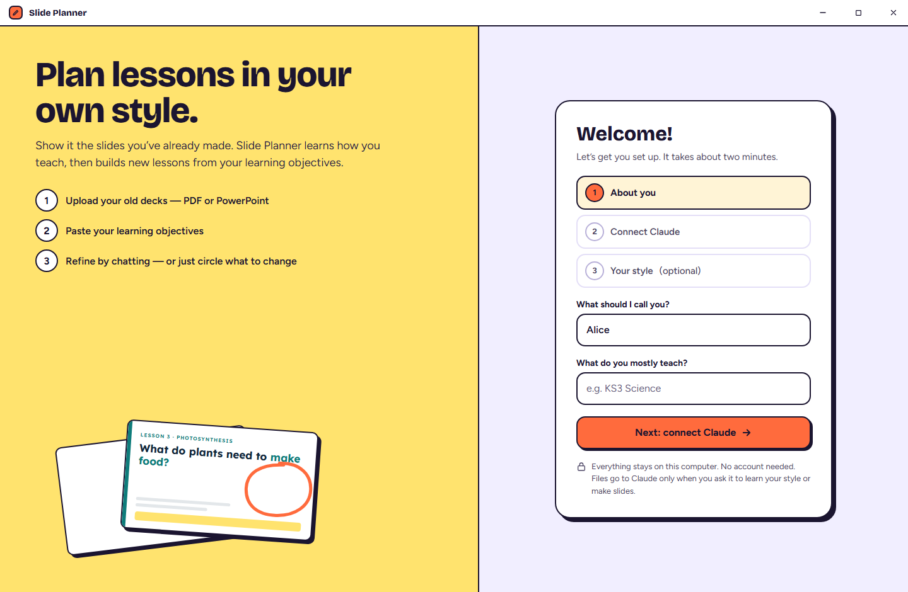
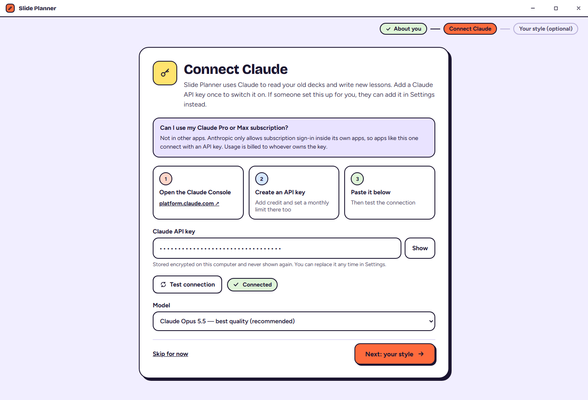
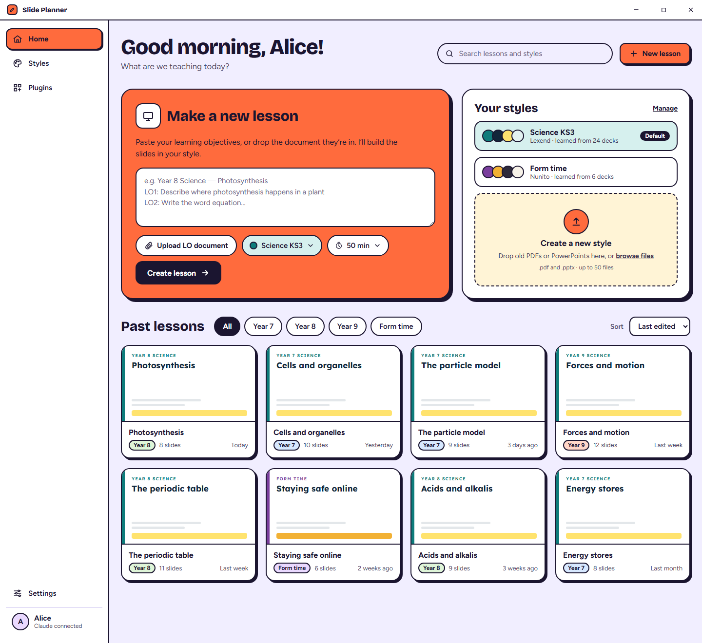
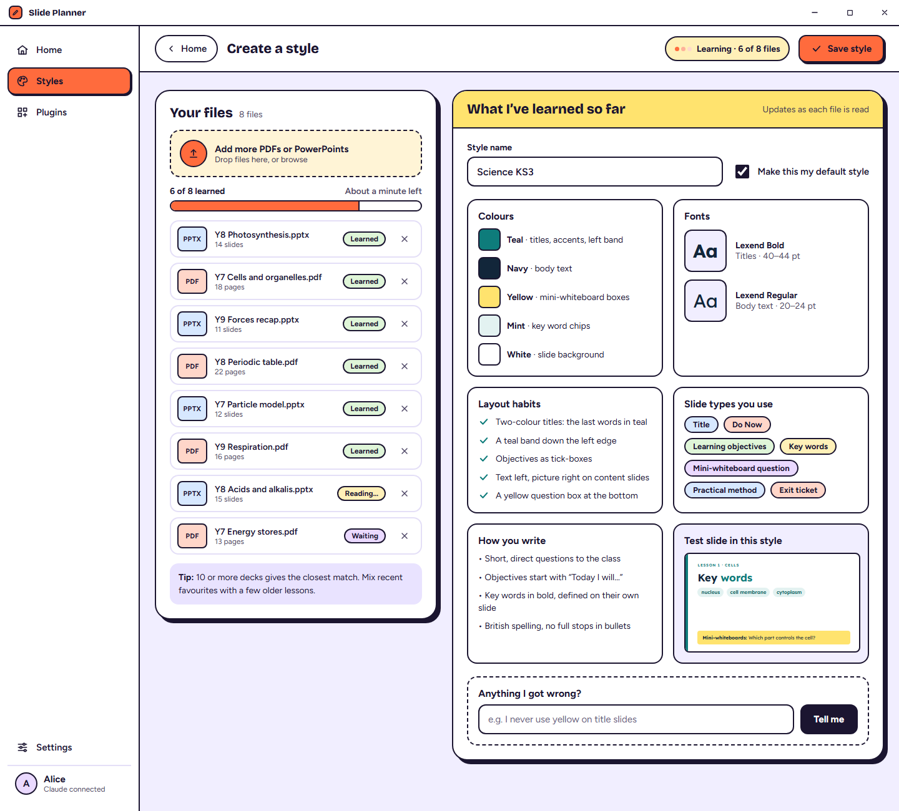
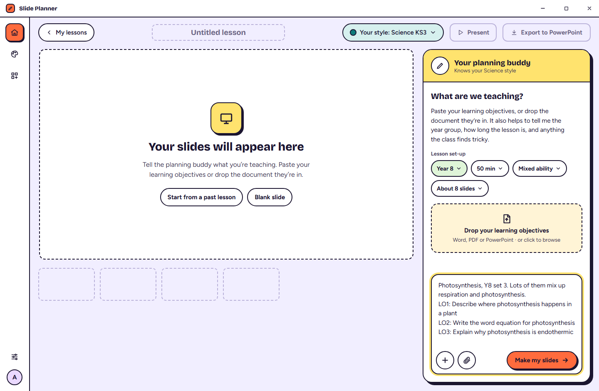
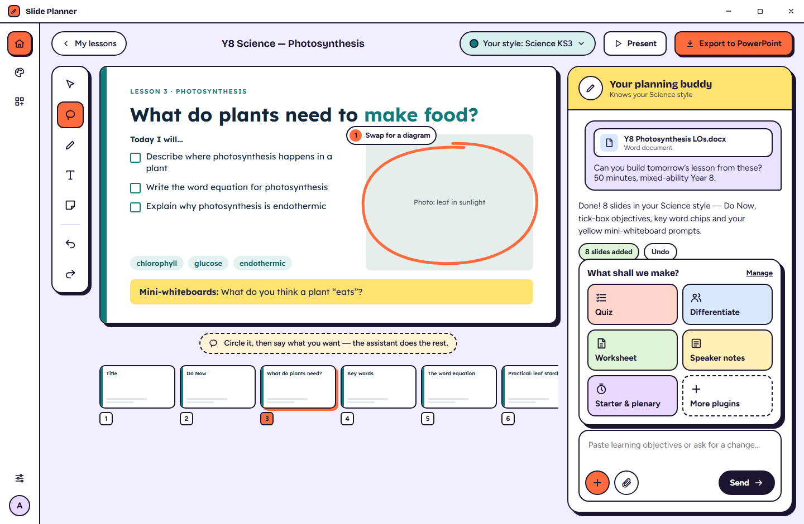
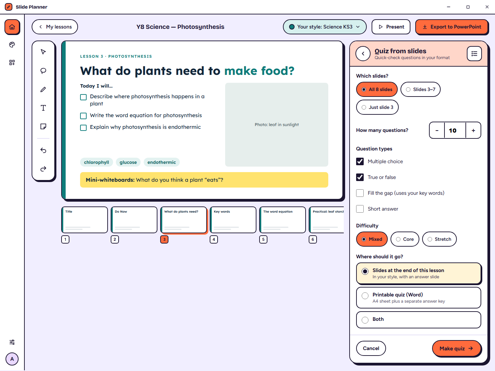

# Design — Slide Planner (working title)

The source of truth for how the app **looks and behaves**. The Electron app in this repo is built from this folder; code-side rules live in `agents/`. When a design decision changes, update this folder first.

**Live design canvas:** https://claude.ai/artifact/SU4W4p1kKQPcM8JZk8QDYS (private until shared from its Share menu). In Play mode the screens link to each other. Offline you can click through `mockups/Welcome.html` in a browser instead.

**Chosen direction:** B · Classroom (bold, friendly, ink outlines, orange accent).

## Screens

| # | Screen | Image |
|---|---|---|
| 1 | Welcome (first run) |  |
| 2 | Connect Claude (first run + Settings › AI) |  |
| 3 | Home |  |
| 4 | Create a style |  |
| 5 | New lesson |  |
| 6 | Editor: chat, circle-to-edit, + menu |  |
| 7 | Plugin options (Quiz) |  |

## What's in here

| Path | What it is | Read it when |
|---|---|---|
| `AGENTS.md` | How coding agents should use this folder | First |
| `product-brief.md` | Product spec: who, goals, features F1–F8, release plan | Before anything |
| `build-plan.md` | Milestones M1–M10 with "done when" checks | Planning work |
| `design-system.md` + `tokens.css` | Colours, type, spacing, shadows, every component and its states | Any UI work |
| `screens/` | One spec per screen: layout, copy, data, states, behaviour, acceptance criteria | Building a screen |
| `deck-model.md` | The lesson/slide data model, edit operations, rendering, PowerPoint export | Deck, editor, export work |
| `style-profile.md` | What "her style" is and how it's learned from PDFs/PowerPoints | Style work |
| `ai-pipeline.md` | Every Claude call, prompts, editor tools, circle-to-edit, errors, cost | Any AI work |
| `plugin-architecture.md` | The + menu: plugin manifest, generated forms, first plugins | Adding features |
| `claude-access.md` | Why it's an API key and not "Sign in with Claude" | Settings/auth work |
| `design-directions.md` | A/B/C history (B chosen) | Curiosity |
| `fixtures/` | Sample style profile + sample lesson matching the mockups | Tests and demos |
| `images/` | PNG of every screen (regenerate with `tools/`) | Visual reference |
| `mockups/` | Static clickable HTML of every screen | Visual reference |
| `canvas/project/` | Source of the canvas artboards (`*.dc.html`, `canvas.json`) | Editing the design |
| `tools/` | `render-mockups.mjs` to regenerate images and mockups | After design changes |

## Status

| Date | Change |
|---|---|
| 2026-10-06 | First drafts: three directions for the editor screen. |
| 2026-10-06 | **Direction B chosen.** Designed Welcome, Connect Claude, Home (new lesson + styles + past lessons), Create a style, New lesson, Editor, Plugin sheet. Matched the desktop shell (40px title bar, 224px sidebar / 72px rail). "Sign in with Claude" replaced by Connect Claude with an API key (subscription sign-in isn't allowed for third-party apps; see `claude-access.md`). Wrote the full build spec. |

## Open decisions (for the owner)
1. **App name:** the design says "Slide Planner"; the code says "Planning App". Pick one.
2. **Who pays for Claude:** the teacher's own API key, or the builder's key added in Settings.
3. **Screens still to design:** Settings, the Plugins page (manager), a full Lessons library (if Home's grid isn't enough), Present mode, the editor while a lesson is generating (described in specs, not drawn).
4. **Privacy:** confirm whether her old decks contain pupil names (affects the warning on Create a style).
5. **Small design gaps for the next pass:** listed in `screens/README.md` → "Mockup inconsistencies". Examples: what the Draw and Sticky note tools do, where speaker notes show in the editor, a Styles list page, the "Manage" / "More plugins" destinations, and Create a style without the sidebar during first run.
6. **Code-side changes the specs rely on** (for the IDE agents to record in `agents/DECISIONS.md` before building): see `screens/README.md` → "Framework changes". Examples: sidebar/rail/no-sidebar per screen, navigation that opens a specific lesson, a shared UI kit, dropped-file paths, full-screen Present, bundled fonts, window minimum width 1100px.
