# Proposal: "Your assets" — WAITING FOR CONFIRMATION

**Status:** designs only, waiting for the owner's OK. **Nothing in `design/` has changed.** Don't build from this folder yet.
When it's approved, the full build spec goes into this folder: screens, data model, AI steps and build order, in the same format as `design/`. Merging it into `design/` happens only when the owner asks.

**Proposal canvas:** https://claude.ai/artifact/Sxo53dSsUwHhPDLBtzxyqT (the main app canvas is https://claude.ai/artifact/SU4W4p1kKQPcM8JZk8QDYS). Both are private until shared.

---

## The addition, precisely

### 1. An "Assets" page (A1)
A new sidebar item between Styles and Plugins: a library of the teacher's reusable pictures (logos, icons, pictures, diagrams, banners, characters). Each asset has:
- the image
- a unique **chat name** (`school_logo`)
- a **description Claude reads**
- a kind and tags
- which decks it was **found in** and which lessons it's **used in**

Two tabs: **Your assets** and **Find online** (A9).

### 2. Filling the library
- **While learning a style (A6):** Claude also spots the pictures she reuses ("Assets I found").
- **Upload images**, or **upload a PDF/PowerPoint** with several pictures. The app cuts each one out, and Claude names and labels them.
- **Find online (A9):** search free image libraries, tick results and "Add 3 to Your assets". "Free to use in lessons" is on by default. Each result shows its source and licence, and credits go into the speaker notes automatically.
- **Make a new one like these (A8):** tick a few assets, describe what you want ("a Bunsen burner with a lit flame"), get 2 or 4 versions in the same look, keep one and name it.
- **Nothing is saved without her OK (A2).** Photos that might show pupils, blurry pictures and repeats are left out by default.

### 3. Using assets in a lesson
- **+ menu › Add asset (A3–A4):** a picker over the chat panel. Picking one puts an **asset chip** into the message; typing `{{` opens the same picker.
- **Natural chat (A5):** "Put `{{school_logo}}` in the top right", then "make it smaller". Each change is one undo step.
- **Circle → Add asset here (A10–A11):** after circling an area, a small bar appears by the circle: **Add asset here · Ask Claude · ×**.
  - "Add asset here" opens the picker as a side sheet over the chat, with assets suggested for that slide.
  - The chosen asset is **scaled automatically to the circle**: fit inside, or fill.
  - It can **replace what's underneath**, and the slide shows a live preview before "Place it".
- **Claude uses assets while generating (A12):** when it makes a lesson it uses relevant assets, and the chat says which ("I used `school_logo` on the title slide…"). Where a picture would help but she has none, it leaves a **picture spot**: a dashed black box with a description such as "A leaf in sunlight, close up" or "An ancient cave painting".
- **Filling picture spots (A12–A13):**
  - Spots are counted in the chat ("3 picture spots to fill") and marked on the filmstrip.
  - Clicking a spot opens the same side sheet as a circle, with three tabs: **Your assets · Find online** (already searched for the spot's description) **· Make one**.
  - "Place it · next spot" works through them one by one.
  - Unfilled spots are skipped when exporting to PowerPoint, with a warning first.

### 4. Setup: an optional picture maker (A7)
The Connect Claude screen (first run and Settings › AI) gets an optional second section, **"Add a picture maker"**:
- a Google AI Studio API key for **Google Nano Banana Pro** (Gemini 3 Pro Image)
- Test, Show/Hide, and "Skip — I'll add it later"
- the key is stored encrypted on the PC, like the Claude key

It powers "Make a new one like these" and "Make one" for picture spots. **Without it**, Claude draws simple icons and diagrams itself (as vector drawings), but it can't make photo-like pictures.

### 5. How style learning changes (A6)
Learning a style now also produces:
- **Picture habits:** where pictures usually go and how big; which kinds she uses (photos, line icons, diagrams); which slide types never have pictures; and **which asset goes with which slide type** (e.g. `school_logo` top-right on title slides, `timer_icon` on Do Now slides).
- **Assets found** (her reusable pictures, for review).

Generation uses the picture habits to decide when to use an asset, where to put it and how big, and when to leave a picture spot instead.

## Screens

| # | Screen | Image |
|---|---|---|
| A1 | Your assets: library, details, "12 found" banner, tabs | 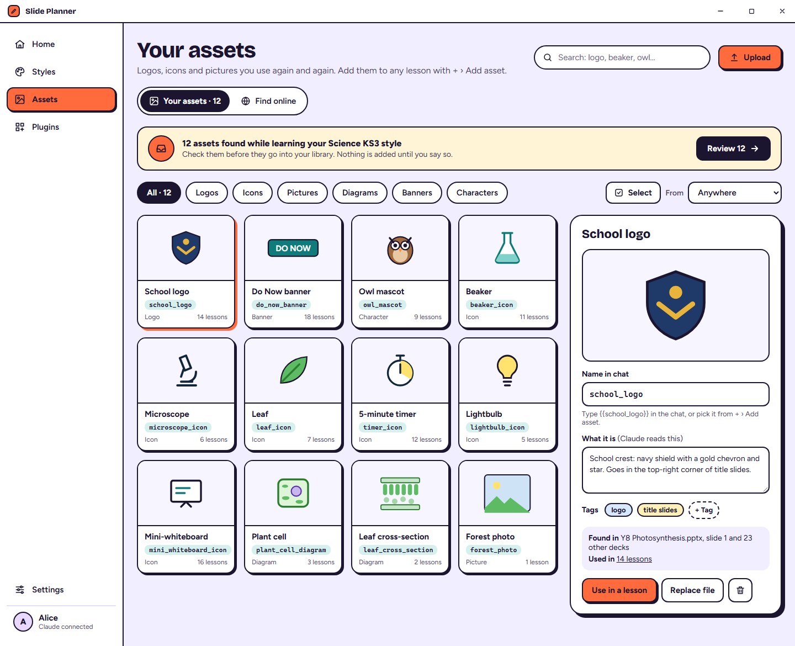 |
| A2 | Check what I found (review before saving) | 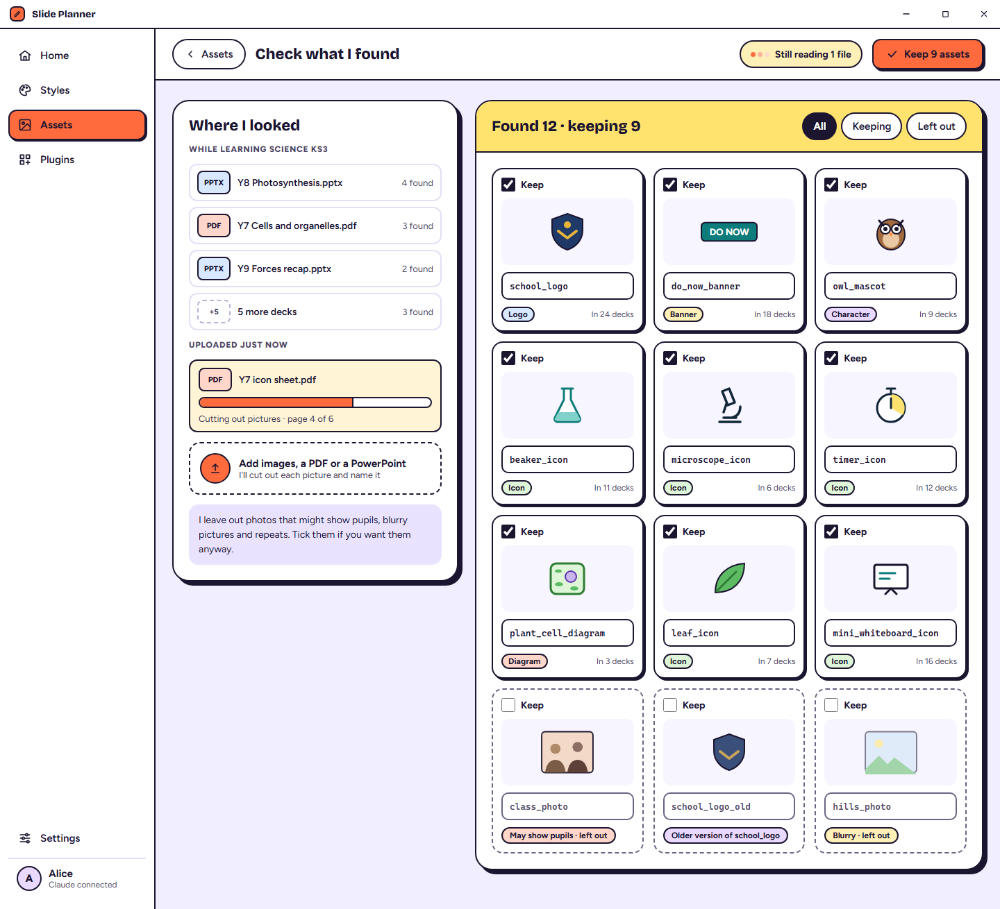 |
| A3 | + menu with Add asset | 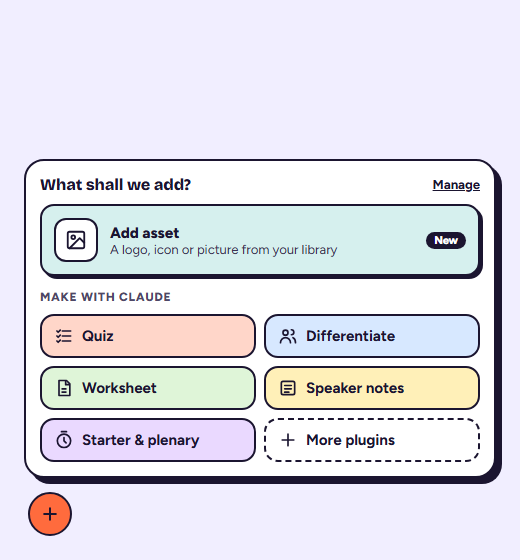 |
| A4 | Editor: asset picker | 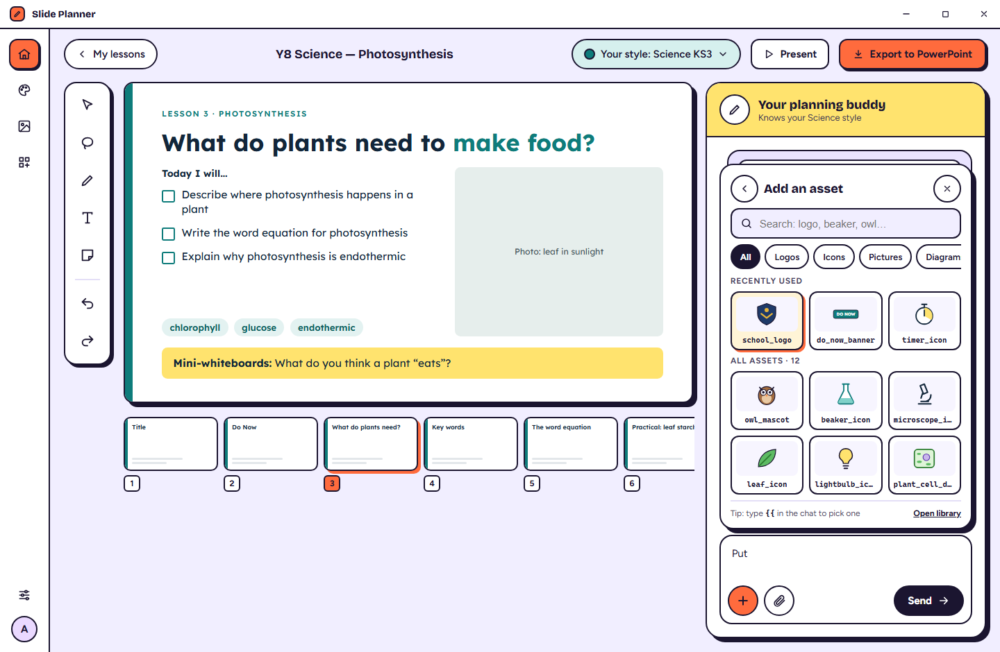 |
| A5 | Editor: asset chip in chat, placed and adjusted | 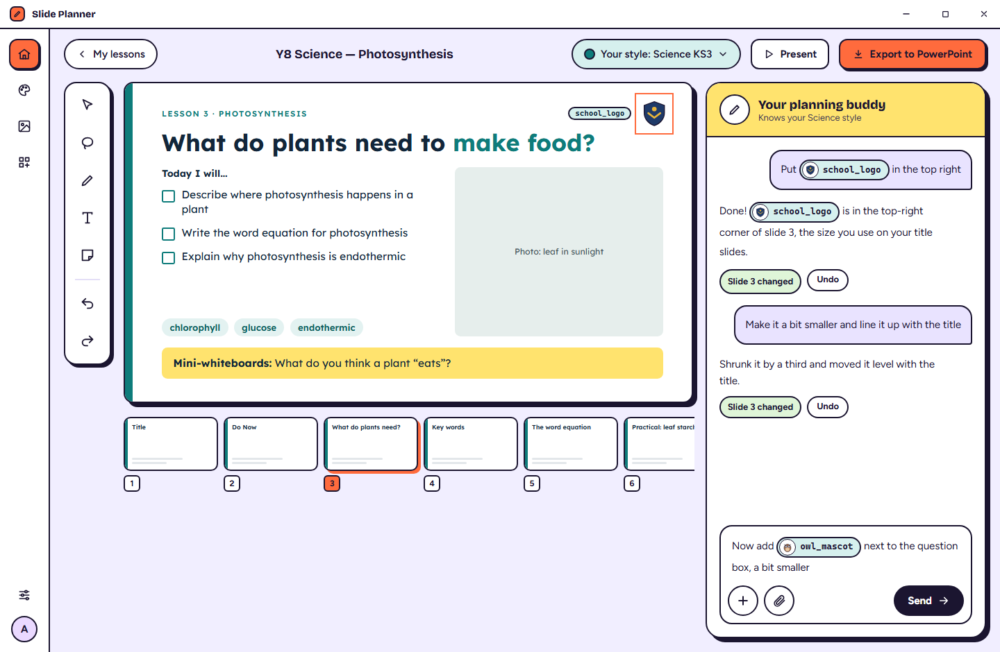 |
| A6 | Create a style: picture habits + assets found | 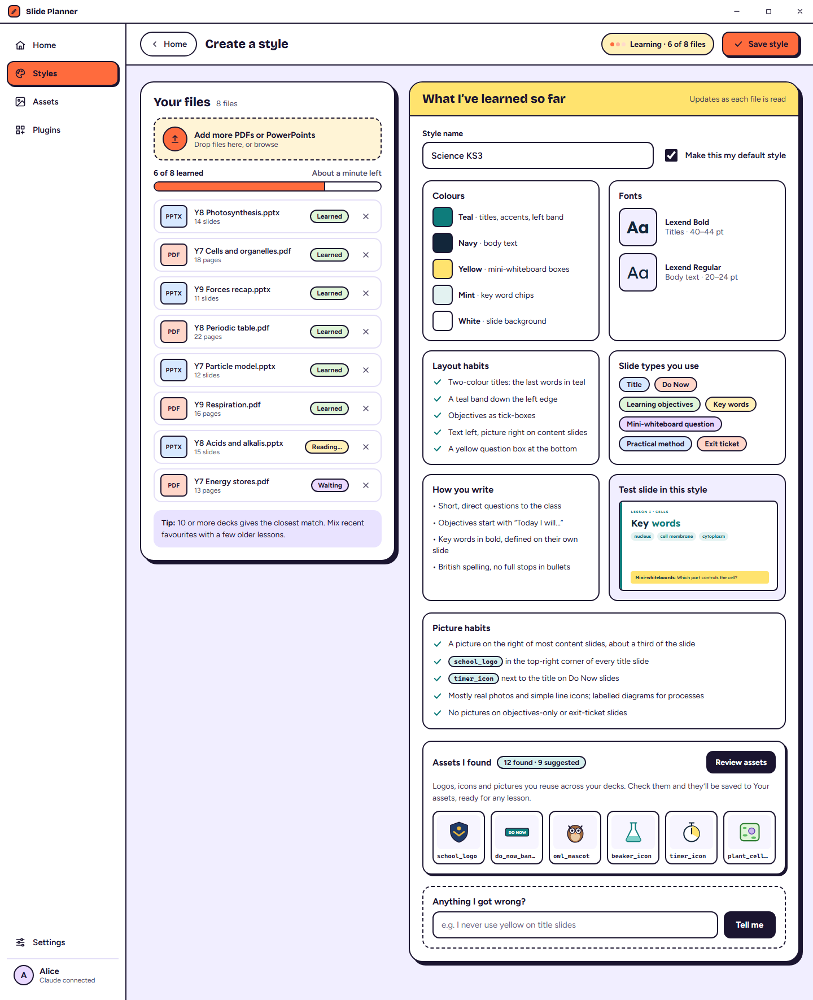 |
| A7 | Setup: Claude + optional picture maker (Nano Banana Pro) | 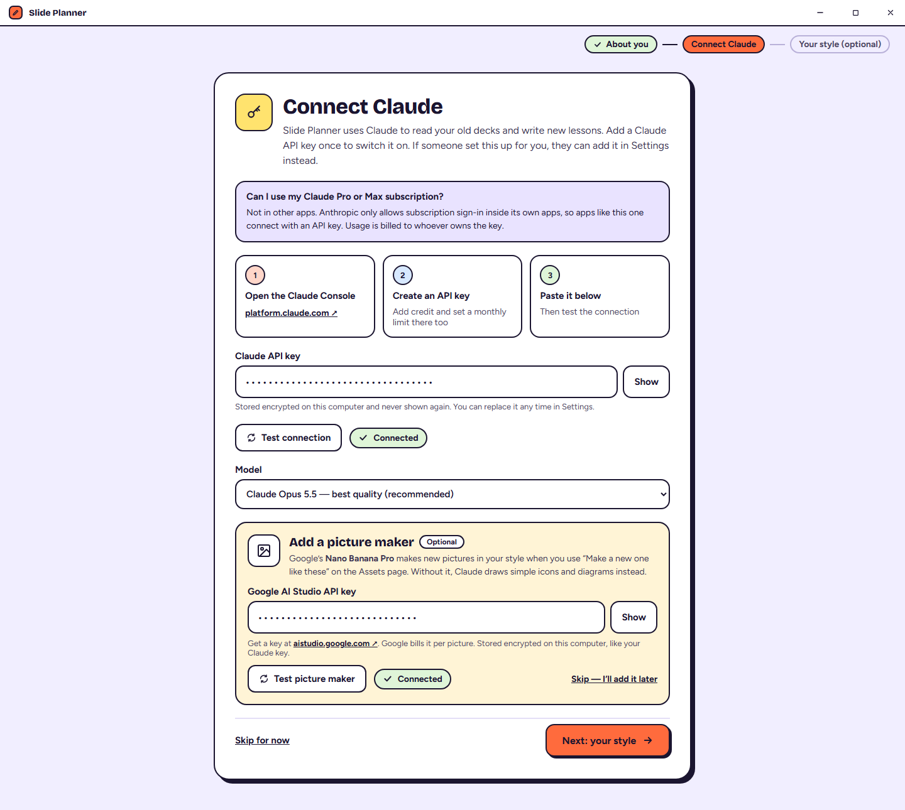 |
| A8 | Assets: select some, make a new one in the same style | 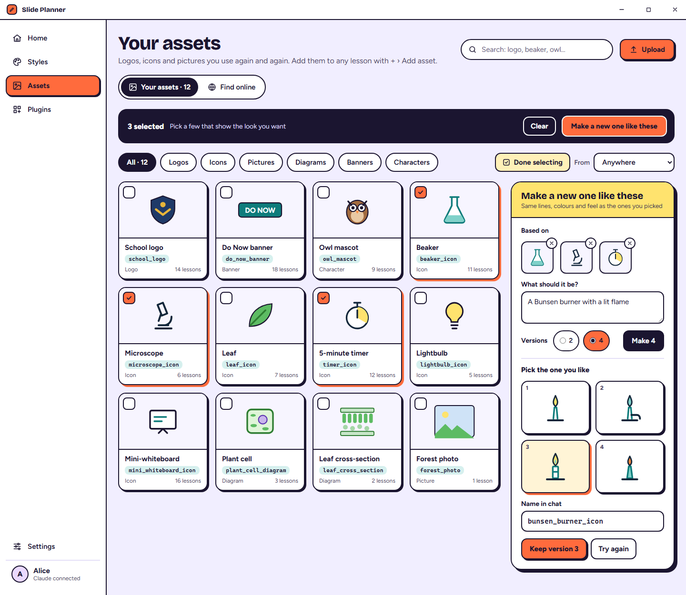 |
| A9 | Assets: find images online | 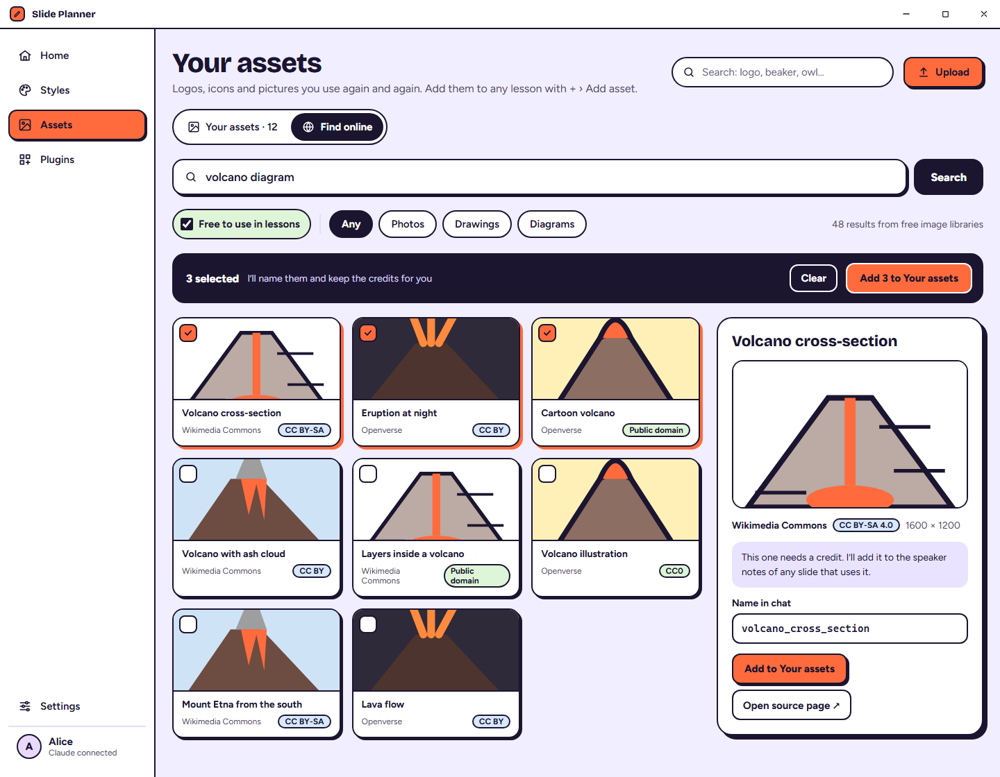 |
| A10 | Editor: circle something → Add asset here | 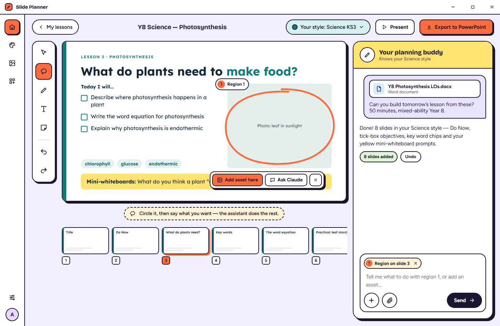 |
| A11 | Editor: pick an asset, scaled to the circle | 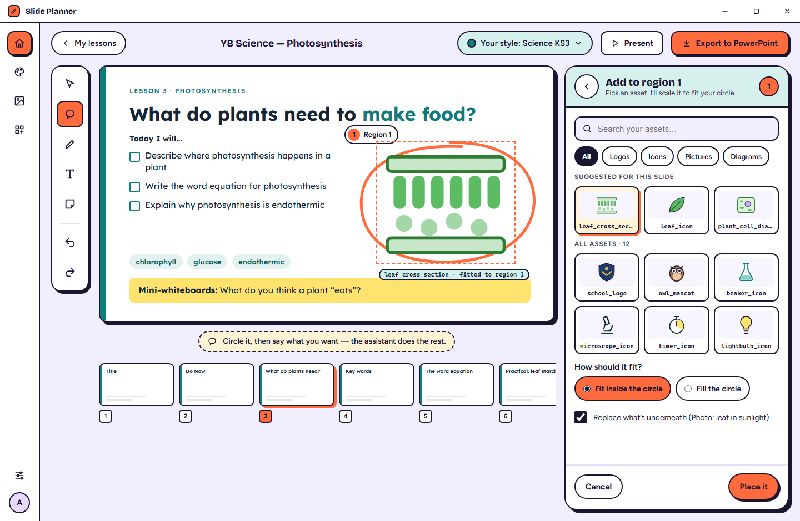 |
| A12 | Editor: picture spots left by Claude | 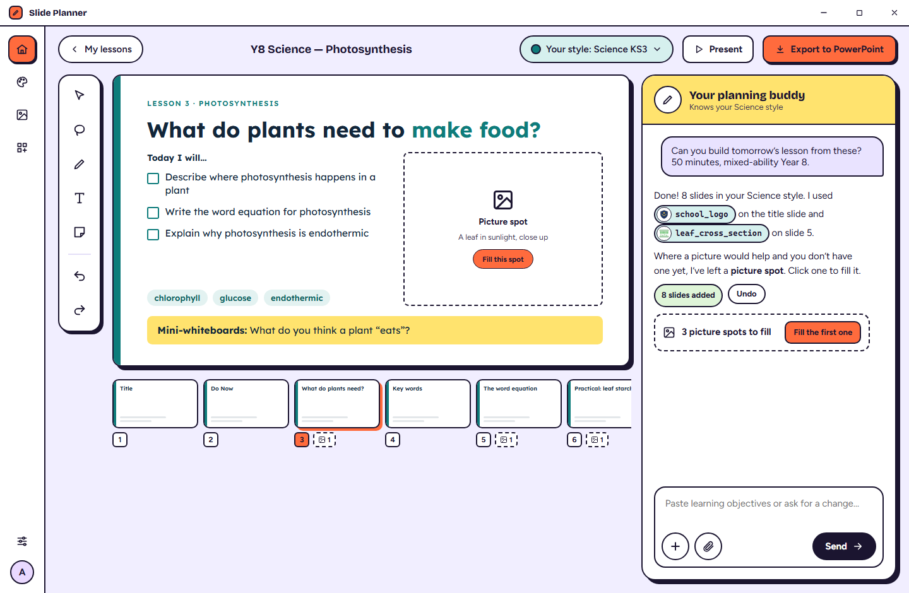 |
| A13 | Editor: fill a picture spot (assets / online / make one) | 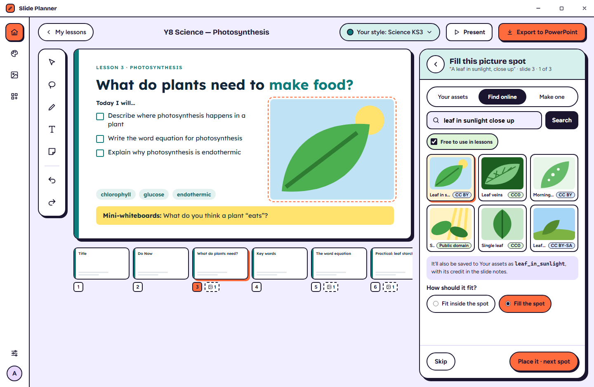 |

Sources of the mockups: `canvas/project/*.dc.html`.

## Design choices to confirm
1. **Chips, not raw text:** `{{name}}` shows as a picture-plus-name pill. Typed `{{name}}` still works and becomes a chip.
2. **Side sheet over the chat** for every "pick an asset" moment (+ menu, circle, picture spot), so the slide stays visible with a live preview.
3. **Review before saving** for anything found automatically or picked online.
4. **Free-to-use filter on by default** for online search, and credits kept automatically.
5. **Picture spots** are editor-only marks. They never print or export.

## Things the build will need (for the spec after approval)
- **An image search service:** Claude's own web search returns pages, not image results. Suggested: free, licence-aware libraries such as **Openverse** and **Wikimedia Commons**, optionally Pexels/Unsplash with their own free keys. Decide which ones.
- **Google Nano Banana Pro:** a separate Google key and per-picture billing. Confirm the exact model id when building; at the time of writing it's listed as `gemini-3-pro-image` / `gemini-3-pro-image-preview`.
- **Licences:** store source, author and licence with every online asset, and add credits to the notes of slides that use it.
- **Privacy:** pupil-photo detection is a best guess, so the review step stays the safety net.

## Not in this proposal (possible later)
Background removal, cropping or editing assets, folders, sharing assets between teachers.
